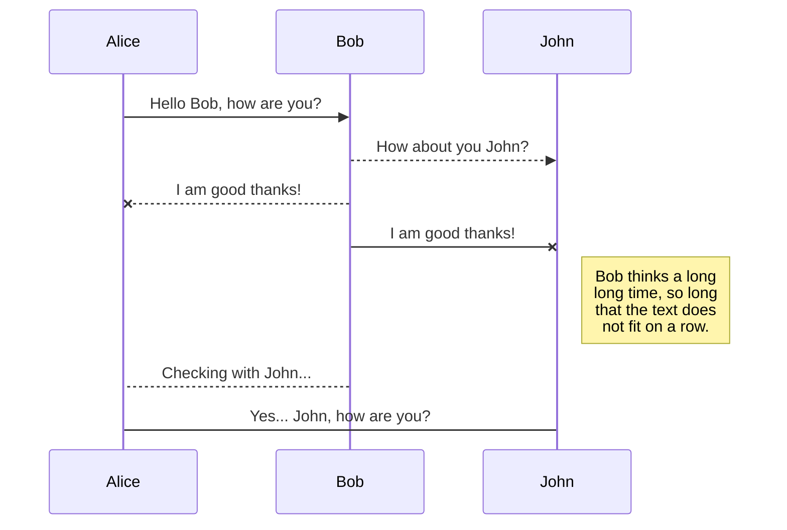
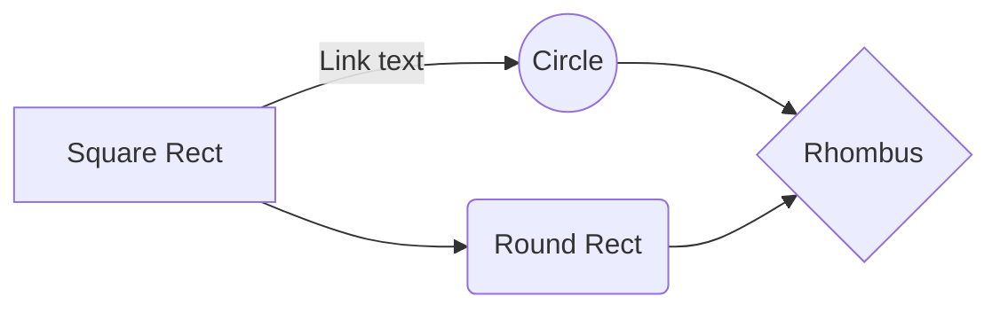

# Variant Calling
BENG 183 Group 1
Authors: Haoyin Xu, Hongru Yu, Ginny Wu

## Introduction
The genomes of individuals and overall populations are all incredibly similar; humans share 99.9% of our DNA while the remaining 0.1% of variations instructs our diversity.[[1]](https://www.genome.gov/17516714/2006-release-about-whole-genome-association-studies) These variations arise from random mutations as well as from gene recombinations in the germ line. When we compare genomes, the variations can be searched for and used to study anything from diseases to body development. For example, variations can be used to map the development of cell lineages in an embryo or the growth of a cancerous tumor.

Figure 1a: SNP Example 
Figure 1b: Indel Example

  
The specific ways variant DNA sequences appear can be categorized into three groups: SNPs, indels, and structural variations. Single nucleotide polymorphisms (SNPs) represent differences of a single nucleotide. Indels are insertions and deletions of segments of DNA and not as common as SNPs. Structural variations are much larger and typically characterized as more than 1 kb in length. These segments can be inverted, translocated, or copied redundantly within the genome. Variant calling is the process by which these variations are identified from sequence data.

## Strategies (examples to be added)

Different variant calling methods rely on several kinds of general strategies, including probabilistic strategy, heuristic strategy, and machine learning. Each of these approaches has its own advantages and disadvantages, and researchers may choose depending on the actual data and sample type.
#### Bayes' Method
The probabilistic approach takes a Bayesian perspective on the data. Researchers use the data to generate prior estimates for genotype probabilities ( **P(G)** ), create error models for data observations ( P(D|G) ), and combine these steps to calculate the probabilities of variants at certain loci. During these calculations, researchers have to consider the effects of linkage disequilibrium, which makes genotypes at adjacent loci not independent.

Figure 2: Bayes’ Theorem
 

#### Heuristic Method
Heuristic based algorithms serve as an alternative method. Instead of calculating genotype possibilities, researchers would use a list of heuristic factors to set the bounds for variant calling. Those factors might include minimum allele counts, read quality cut-offs, and depth levels of read coverage. Though a relatively unpopular approach, the method could robustly outly data that violate the assumptions of probabilistic models.

#### Machine Learning Method
Machine learning represents researchers’ recent attempts to optimize the current variant calling methods. Relying on convolutional neural network (CNN), the method is able to magically output genotype likelihoods. Researchers currently have few practical ways to understand the nature of these neural networks, but try their best to make sure that the accuracy of input data meet their expectations.

## Procedure (to be filled)
After the whole genome or exome is sequenced, the raw reads in FASTQ files are quality checked and aligned to the reference genome, resulting in BAM or CRAM files. The alignment shows how the sequences are different from the reference genome, and these variants can be further analyzed to confirm their significance.

Because this is a comparative analysis, the algorithms can differ depending on sample type. There are many packages and pipelines that have been developed to accommodate for diploidy, somatic cells, and germline cells.

## Significance (to be filled)
More discussion on applications of variant calling. Examples include [Feliciano, 2018].(https://doi.org/10.1016/j.tube.2018.04.003)

## Demo
We demonstrate an analysis pipeline starting from analysis ready reads to final BAM files showing variant sequences and locations. Tools used are FastQC for quality check, samtools for alignment, VCF for variant calling, bftools, SnpEff for variant annotation, and IGV for visualization of read coverage and variant type.

Setup utput file and reference genome file:
>file=log.txt
end=.fastq.gz
ref=tuberculosis.fasta
>bwa index $ref

Start variant calling pipeline on all read files:
>echo "Executing main commands" | tee -a $file
for prefix in ERR2432987 ERR2432988 ERR2432989 ERR2433004 ERR2433005 ERR2433006
do

>echo "Running fastqc on ${prefix}" | tee -a $file
>fastqc -o . \${prefix}_1${end} \${prefix}_2${end} | tee -a $file

>echo "Running sickle with q.c. of 30" | tee -a $file
sickle pe -q 30 -f \${prefix}_1${end} -r \${prefix}_2${end} -t sanger \
-o ${prefix}_t1.fastq -p ${prefix}_t2.fastq -s singletons.fastq \
| tee -a $file

>echo "Running fastqc on trimmed ${prefix} files" | tee -a $file
fastqc -o . ${prefix}_t1.fastq ${prefix}_t2.fastq | tee -a $file
  
>echo "Aligning tuberculosis sequences onto the reference genome" | tee -a $file
bwa mem $ref ${prefix}_t1.fastq ${prefix}_t2.fastq > ${prefix}.sam | tee -a $file

>echo "Checking the quality of sam file" | tee -a $file
samtools flagstat ${prefix}.sam

>echo "Converting sam file to bam file" | tee -a $file
  samtools view -S -b ${prefix}.sam > ${prefix}.bam | tee -a $file

>echo "Sorting bam file" | tee -a $file
samtools sort ${prefix}.bam > ${prefix}_s.bam | tee -a $file

>echo "Indexing the bam file" | tee -a $file
  samtools index ${prefix}_s.bam | tee -a $file

>echo "Making a pileup" | tee -a $file
samtools mpileup -f $ref ${prefix}_s.bam > ${prefix}.mpileup | tee -a $file

>echo "Running VarScan" | tee -a $file
java -jar VarScan.jar mpileup2snp ${prefix}.mpileup --min-var-freq 0.90 \
--variants --output-vcf 1 > ${prefix}_raw.vcf | tee -a $file

>echo "Running awk to format the vcf file" | tee -a $file
awk '{if (NR>24) $1="Chromosome"; print}' ${prefix}_raw.vcf> ${prefix}.vcf | tee -a $file

>echo "Cleaning temporary files" | tee -a $file
rm *.sam *.bam *.mpileup *raw.vcf
done

### Galaxy Tool Variant Calling Pipeline
Another demo using the Galaxy tool for variant calling in different settings (diploid/haploid, somatic/germline).

  

## References:
[Fun statistic](https://www.genome.gov/17516714/2006-release-about-whole-genome-association-studies) in intro

Wikipedia for variant calling: [https://en.wikipedia.org/wiki/SNV_calling_from_NGS_data](https://en.wikipedia.org/wiki/SNV_calling_from_NGS_data)
Basic pipeline: [https://datacarpentry.org/wrangling-genomics/04-variant_calling/index.html](https://datacarpentry.org/wrangling-genomics/04-variant_calling/index.html)
Galaxy pipelines: [https://galaxyproject.github.io/training-material/topics/variant-analysis/](https://galaxyproject.github.io/training-material/topics/variant-analysis/)

# Synchronization

Synchronization is one of the biggest features of StackEdit. It enables you to synchronize any file in your workspace with other files stored in your **Google Drive**, your **Dropbox** and your **GitHub** accounts. This allows you to keep writing on other devices, collaborate with people you share the file with, integrate easily into your workflow... The synchronization mechanism takes place every minute in the background, downloading, merging, and uploading file modifications.

There are two types of synchronization and they can complement each other:

- The workspace synchronization will sync all your files, folders and settings automatically. This will allow you to fetch your workspace on any other device.
	> To start syncing your workspace, just sign in with Google in the menu.

- The file synchronization will keep one file of the workspace synced with one or multiple files in **Google Drive**, **Dropbox** or **GitHub**.
	> Before starting to sync files, you must link an account in the **Synchronize** sub-menu.

## Open a file

You can open a file from **Google Drive**, **Dropbox** or **GitHub** by opening the **Synchronize** sub-menu and clicking **Open from**. Once opened in the workspace, any modification in the file will be automatically synced.

## Save a file

You can save any file of the workspace to **Google Drive**, **Dropbox** or **GitHub** by opening the **Synchronize** sub-menu and clicking **Save on**. Even if a file in the workspace is already synced, you can save it to another location. StackEdit can sync one file with multiple locations and accounts.

## Synchronize a file

Once your file is linked to a synchronized location, StackEdit will periodically synchronize it by downloading/uploading any modification. A merge will be performed if necessary and conflicts will be resolved.

If you just have modified your file and you want to force syncing, click the **Synchronize now** button in the navigation bar.

> **Note:** The **Synchronize now** button is disabled if you have no file to synchronize.

## Manage file synchronization

Since one file can be synced with multiple locations, you can list and manage synchronized locations by clicking **File synchronization** in the **Synchronize** sub-menu. This allows you to list and remove synchronized locations that are linked to your file.

# Publication

Publishing in StackEdit makes it simple for you to publish online your files. Once you're happy with a file, you can publish it to different hosting platforms like **Blogger**, **Dropbox**, **Gist**, **GitHub**, **Google Drive**, **WordPress** and **Zendesk**. With [Handlebars templates](http://handlebarsjs.com/), you have full control over what you export.

> Before starting to publish, you must link an account in the **Publish** sub-menu.

## Publish a File

You can publish your file by opening the **Publish** sub-menu and by clicking **Publish to**. For some locations, you can choose between the following formats:

- Markdown: publish the Markdown text on a website that can interpret it (**GitHub** for instance),
- HTML: publish the file converted to HTML via a Handlebars template (on a blog for example).

## Update a publication

After publishing, StackEdit keeps your file linked to that publication which makes it easy for you to re-publish it. Once you have modified your file and you want to update your publication, click on the **Publish now** button in the navigation bar.

> **Note:** The **Publish now** button is disabled if your file has not been published yet.

## Manage file publication

Since one file can be published to multiple locations, you can list and manage publish locations by clicking **File publication** in the **Publish** sub-menu. This allows you to list and remove publication locations that are linked to your file.

## SmartyPants

SmartyPants converts ASCII punctuation characters into "smart" typographic punctuation HTML entities. For example:

|                |ASCII                          |HTML                         |
|----------------|-------------------------------|-----------------------------|
|Single backticks|`'Isn't this fun?'`            |'Isn't this fun?'            |
|Quotes          |`"Isn't this fun?"`            |"Isn't this fun?"            |
|Dashes          |`-- is en-dash, --- is em-dash`|-- is en-dash, --- is em-dash|

## KaTeX

You can render LaTeX mathematical expressions using [KaTeX](https://khan.github.io/KaTeX/):

The *Gamma function* satisfying $\Gamma(n) = (n-1)!\quad\forall n\in\mathbb N$ is via the Euler integral

$$
\Gamma(z) = \int_0^\infty t^{z-1}e^{-t}dt\,.
$$

> You can find more information about **LaTeX** mathematical expressions [here](http://meta.math.stackexchange.com/questions/5020/mathjax-basic-tutorial-and-quick-reference).

## UML diagrams

You can render UML diagrams using [Mermaid](https://mermaidjs.github.io/). For example, this will produce a sequence diagram:

And this will produce a flow chart:

<!--stackedit_data:
eyJoaXN0b3J5IjpbMzU1Njc3MjQyLDE2MjA4NzMyMjYsLTQ1ND
MxMzY0M119
-->